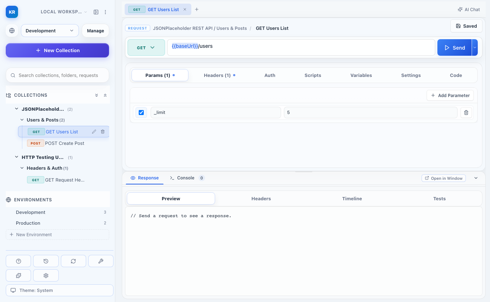
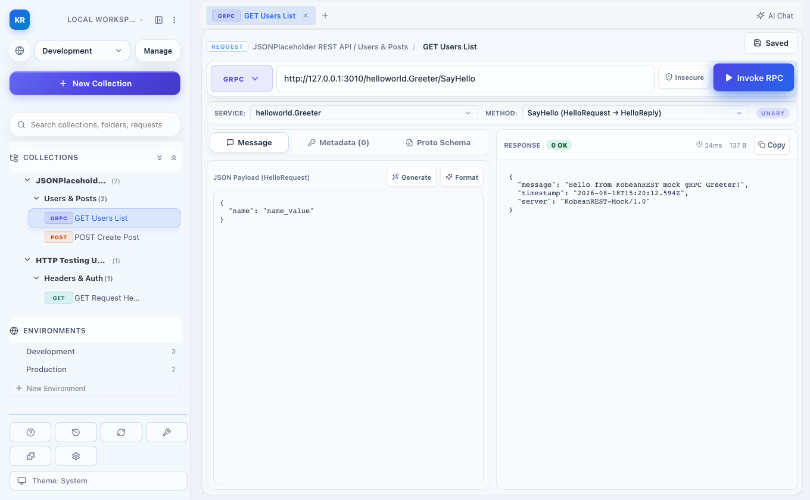
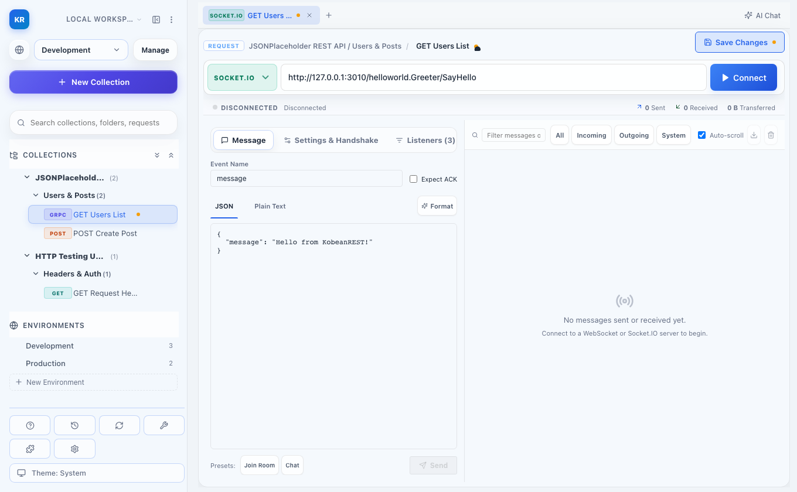
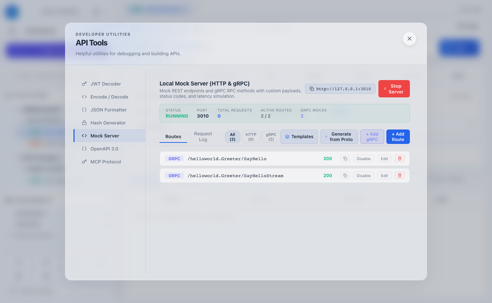
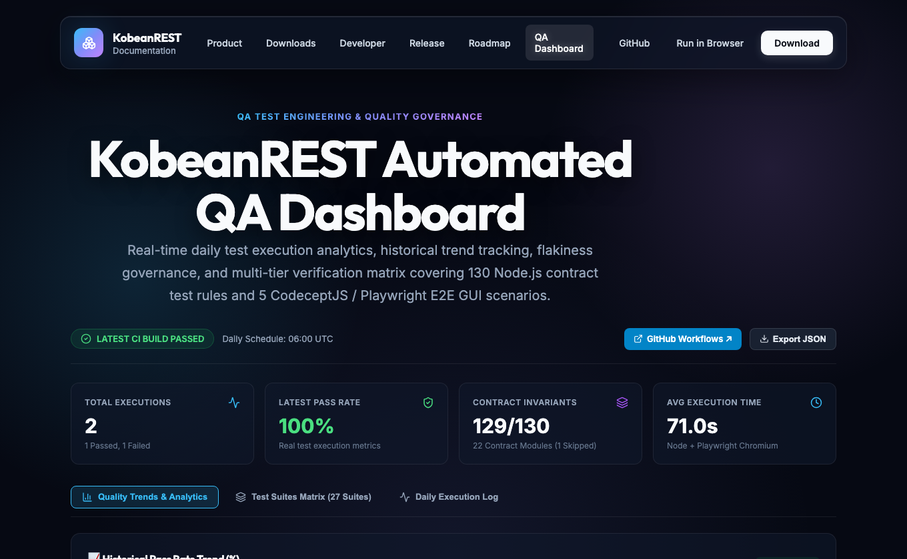
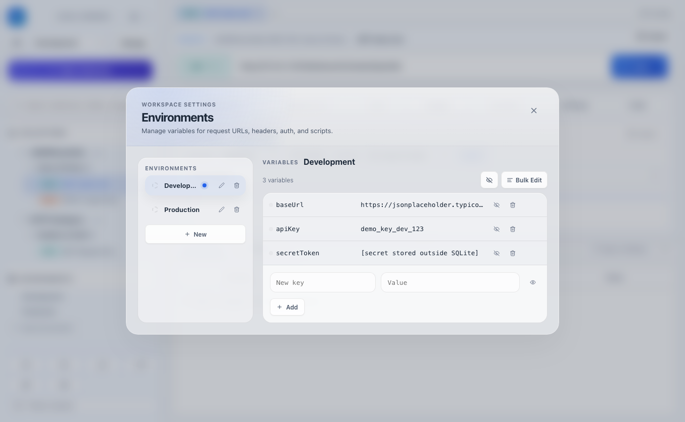
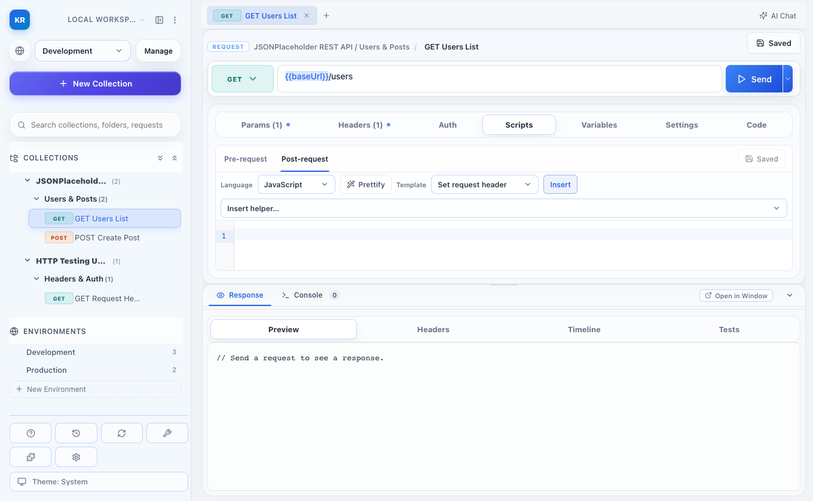
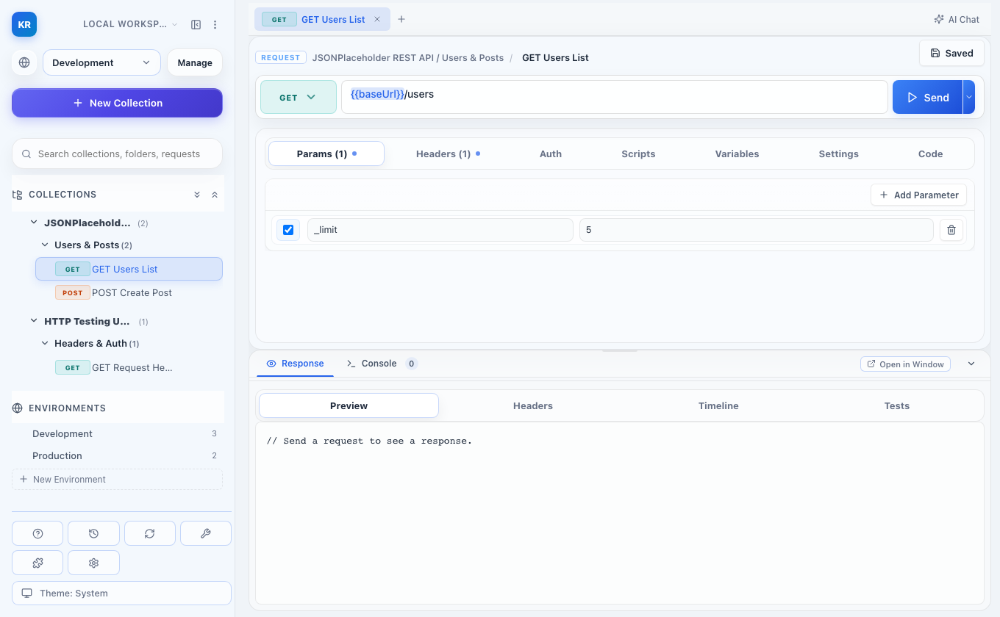
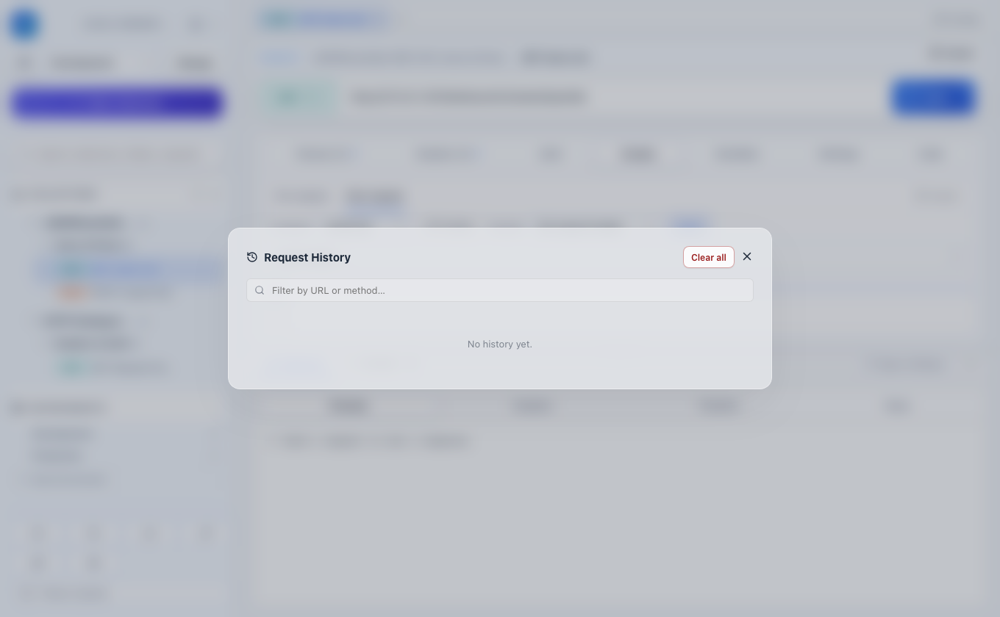

<div align="center">

# ⚡ KobeanREST

**A fast, local-first desktop API client for REST, gRPC, WebSocket, Socket.IO, and GraphQL workflows.**

*No account required. No cloud sync forced. 100% local workspace ownership.*

[](https://github.com/thienng-it/KobeanREST/releases/latest)
[](LICENSE)
[](https://tauri.app)
[](https://react.dev)
[](https://thienng-it.github.io/KobeanREST/)
[](https://thienng-it.github.io/KobeanREST/app/)

---

[📖 Documentation](https://thienng-it.github.io/KobeanREST/) • [🚀 Try Web Preview](https://thienng-it.github.io/KobeanREST/app/) • [📦 Download Desktop App](https://github.com/thienng-it/KobeanREST/releases/latest) • [🗺️ Roadmap](docs/implementation-roadmap.md)

<br />



</div>

<br />

## 🌟 Overview

**KobeanREST** is designed for software engineers, backend developers, and QA teams who need a high-performance API client without forced cloud lock-in or user registration. Download the app, launch it locally, and build, test, and debug REST, gRPC, WebSocket, Socket.IO, and GraphQL endpoints directly on your machine.

> **Local-First Contract:**
> KobeanREST has **no user accounts, no login screens, no cloud telemetry, and no required backend service.** All workspace data is stored in local SQLite databases, and secret credentials remain safely secured in your operating system's native keychain.

---

## ✨ Key Features

| Feature | Description |
| :--- | :--- |
| ⚡ **gRPC & Protobuf RPC Client** | Native gRPC execution engine supporting Unary and Streaming calls with `.proto` IDL loading, service/method selection, sample payload synthesis, custom metadata headers, and latency metrics. |
| 🔌 **WebSocket & Socket.IO Streaming** | Real-time bidirectional message streaming with incoming/outgoing chronological timeline inspector, event emitters, JSON payload trees, and connection state indicators. |
| 📐 **GraphQL Studio & Inspection** | Query and variables editor with syntax highlighting, schema introspection support, and strict GraphQL-over-HTTP error & data status reporting (`GraphQL OK`, `GraphQL Errors`). |
| 🛠️ **Local Mock Server & Starter Templates** | Built-in multi-route HTTP/REST & gRPC mock server with 8 ready-to-use template presets (E-Commerce, OpenAI LLM, DevOps Health, Greeter, Echo Streaming) and Protobuf schema auto-generation. |
| 📥 **Universal API Importer** | 1-click import from cURL, Postman Collections, OpenAPI/Swagger 3.x, Insomnia, HAR, and `.http` files with draft preservation. |
| 🤖 **AI Assistant & Session Manager** | Built-in local/cloud AI Assistant supporting Ollama (Local), OpenAI, Anthropic, Gemini, Groq, OpenRouter, and custom endpoints. Features drag-to-resize sidebar (`28%–48%` window bounds), multi-session management, auto-titling, code copying, prompt suggestions, and automatic non-tool model fallbacks. |
| 🧩 **Extensible Plugin System** | Modular plugin runner with a rich built-in catalog (UUID Request ID, HMAC Signer, Response Time Logger, Rate Limit Checker, JSON Extractor, Status Asserters). |
| 🔐 **Keychain Secret Protection** | Sensitive values (API keys, tokens) stay outside SQLite in OS keychain / encrypted vault storage. |
| 🏃 **Collection Runner** | Execute entire collections sequentially with comprehensive run history and results tracking. |
| 📜 **Pre & Post Request Scripts** | Dynamic JavaScript execution environment with live logs, assertions, and variable injection. |
| 📊 **QA Dashboard** | Real-time test analytics, flakiness governance, and daily telemetry drilldown for automated tests. |
| 🌐 **Live Web Preview** | Try KobeanREST instantly in any modern web browser without installing local desktop binaries. |

<br/>

## 📸 Feature Gallery

<div align="center">
  
  <br/>
  <i>gRPC & Protobuf Client: Interactive Proto loader, method selector, and decoded streaming response viewer.</i>
</div>
<br/>

<div align="center">
  
  <br/>
  <i>WebSocket & Socket.IO: Real-time bi-directional streaming inspector and interactive event emitter.</i>
</div>
<br/>

<div align="center">
  
  <br/>
  <i>Local Mock Server: Built-in multi-route REST & gRPC server with pre-configured starter templates.</i>
</div>
<br/>

<div align="center">
  
  <br/>
  <i>QA Dashboard: Real-time test analytics, suite metrics, and flakiness telemetry drilldown.</i>
</div>
<br/>

<div align="center">
  
  <br/>
  <i>Local Environment & Variables Editor: Keep secrets safe in your native OS keychain.</i>
</div>
<br/>

<div align="center">
  
  <br/>
  <i>Pre & Post Request Scripts: Dynamic execution environment with tests, assertions, and live logs.</i>
</div>
<br/>

<div align="center">
  
  <br/>
  <i>Interactive Query Params: Real-time bi-directional synchronization with the URL bar.</i>
</div>
<br/>

<div align="center">
  
  <br/>
  <i>History Viewer: Detailed logging of past requests and replay functionality.</i>
</div>
<br/>

---

## 📥 Downloads & Installation

Official cross-platform installers are published through GitHub Releases:

👉 **[Download Latest Version (GitHub Releases)](https://github.com/thienng-it/KobeanREST/releases/latest)**

| Platform | Installer Format | Architecture |
| :--- | :--- | :--- |
| **macOS** | `.dmg` | Universal (Apple Silicon & Intel) |
| **Windows** | `.msi` | x64 |
| **Linux** | `.AppImage` / `.deb` | x64 |

*Detailed installation instructions, checksum verification, and OS security notes are available in the [Download Guide](docs/download.md).*

---

## 🏗️ Architecture

```
┌─────────────────────────────────────────────────────────────┐
│                      React Renderer                         │
│   (Request Builder, Params Sync, Env Editor, Bottom Dock)   │
└──────────────────────────────┬──────────────────────────────┘
                               │ Tauri IPC Bridge
┌──────────────────────────────▼──────────────────────────────┐
│                    Rust Desktop Core                        │
│   (Reqwest HTTP Engine, SQLite Persistence, Keychain Vault) │
└─────────────────────────────────────────────────────────────┘
```

| Layer | Responsibility |
| :--- | :--- |
| **Tauri 2 Shell** | Native window management, desktop shortcuts, auto-updater integration |
| **Rust Native Core** | SQLite storage, HTTP client execution engine, OS keychain integrations |
| **React Renderer** | CodeMirror editor, dynamic variable resolution `{{var}}`, theme engines |
| **Docs Portal** | GitHub Pages documentation portal built from `docs-site/` |

---

## 🛠️ Development & Building

### Prerequisites
- [Node.js](https://nodejs.org/) v22+
- [Rust](https://www.rust-lang.org/) stable toolchain
- Cargo & platform build dependencies

### Local Setup

1. **Clone & Install Dependencies:**
   ```bash
   git clone https://github.com/thienng-it/KobeanREST.git
   cd KobeanREST
   npm install
   ```

2. **Run Web Renderer (Dev Mode):**
   ```bash
   npm run dev
   ```

3. **Run Native Desktop App:**
   ```bash
   npm run tauri dev
   ```

4. **Execute Verification & Tests:**
   ```bash
   npm test               # Run contract and unit test suite
   npm run build          # Build TypeScript & Vite renderer
   npm run build:docs     # Build documentation portal
   npm run check:secrets  # Perform Betterleak sensitive-data scan
   npm run check:release  # Run release preflight checks
   ```

---

## 🔒 Security & Privacy

KobeanREST is engineered to keep your workspace data private and local:

- **Redacted Secret Exports:** Workspace exports redact sensitive environment variables by default.
- **Redacted History:** Request history automatically masks sensitive URL query parameters and authorization headers.
- **Automated Scanning:** Every commit and PR is scanned for credential leaks via `Betterleak` in CI (`npm run check:secrets`).

---

## 📄 License

Distributed under the [MIT License](LICENSE). Created and maintained with ❤️ by **[Joseph Thien](https://github.com/thienng-it)** and **[Kobenguyent](https://github.com/kobenguyent)**.
