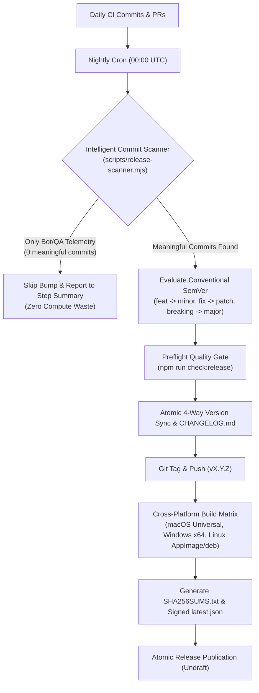

# Release Operations & Release Engineering Runbook

This runbook outlines the enterprise release architecture, governance policies, and standard operating procedures for KobeanREST desktop releases.

- Phase `1L`: Auto Update Flow
- Phase `1M`: Packaging and Release Hardening
- Phase `1N`: Intelligent Commit Scanning, SemVer Automation & Release Governance

---

## 1. Scrum Master Release Strategy ("Release Like a Pro")

Managing releases at scale requires balancing rapid continuous delivery with deterministic quality gates:



### Core Release Governance Principles
1. **Zero-Waste Cadence**: Never create phantom releases when only ephemeral metrics (`docs-site/public/qa-history.json`) or release commits are pushed. A release must represent tangible customer value or code change.
2. **Conventional SemVer**: Version bumps are derived deterministically from Conventional Commits (`feat:`, `fix:`, `perf:`, `BREAKING CHANGE:`).
3. **Multi-Platform Quality Gates**: Before any tag is minted, preflight checks enforce version parity across `package.json`, `package-lock.json`, `src-tauri/tauri.conf.json`, and `src-tauri/Cargo.toml`.
4. **Draft-First Atomic Releases**: Builds and assets are uploaded to a draft release, verified against checksums and signed updater manifests (`latest.json`), and published atomically.

---

## 2. Release Channels & Rings

| Release Ring | Trigger | Change Detection | Target Artifacts |
|---|---|---|---|
| **Nightly Auto-Release** | Daily Cron (`00:00 UTC`) or `workflow_dispatch` | `scripts/release-scanner.mjs` (skips if 0 code commits) | macOS DMG + tar.gz, Windows MSI + ZIP, Linux AppImage + DEB, `latest.json`, `SHA256SUMS.txt`, `CHANGELOG.md` |
| **Stable Milestone Release** | Git Tag Push (`v*.*.*`) or Manual Dispatch | Manual / Release Tag | Signed Multi-Platform Installers, `latest.json`, `SHA256SUMS.txt` |
| **Hotfix Release** | Urgent PR merge with `fix:` / `workflow_dispatch` (`force_release: true`) | Immediate Dispatch | Targeted patch release with automated changelog |

---

## 3. Conventional Commit Matrix for Developers

To ensure automated version bumping behaves predictably, follow Conventional Commits:

| Commit Pattern | SemVer Impact | Changelog Section | Example |
|---|---|---|---|
| `feat:` / `feat(...):` | **Minor** (`0.1.X` -> `0.2.0`) | 🚀 New Features & Enhancements | `feat(sidebar): add accordion transition` |
| `fix:` / `fix(...):` | **Patch** (`0.1.35` -> `0.1.36`) | 🐛 Bug Fixes | `fix(editor): resolve line wrapping glitch` |
| `perf:` / `perf(...):` | **Patch** | ⚡ Performance Improvements | `perf(renderer): throttle resize events` |
| `refactor:` | **Patch** | ♻️ Code Refactoring & Architecture | `refactor(auth): simplify token storage` |
| `docs:` | **Patch** | 📝 Documentation | `docs: add release operations guide` |
| `chore:`, `build:`, `ci:` | **Patch** | 🔧 Build & Maintenance | `build(deps): update tauri dependencies` |
| `BREAKING CHANGE:` / `feat!:` | **Major** (`0.X.Y` -> `1.0.0`) | 💥 Breaking Changes | `feat!: migrate persistence to SQLite v2` |
| `[skip release]` / `[skip bump]` | **Ignored** (No release) | N/A | `chore(qa): update metrics [skip release]` |

---

## 4. Updater Signing Keypair Setup

Run the local Tauri signer command from the repo root:

```bash
node_modules/.bin/tauri signer generate -w ~/.kobeanrest/tauri-updater.key
```

You will receive:
- A private key file at the path you chose.
- A public key printed by the signer.

Keep the private key out of the repo. The public key is the value that replaces `REPLACE_WITH_TAURI_UPDATER_PUBLIC_KEY_BEFORE_PUBLIC_RELEASE` in `src-tauri/tauri.conf.json`.

---

## 5. Configure `tauri.conf.json`

Replace the placeholder public key in `src-tauri/tauri.conf.json`:

```json
"pubkey": "REPLACE_WITH_TAURI_UPDATER_PUBLIC_KEY_BEFORE_PUBLIC_RELEASE"
```

with the real public key produced by `node_modules/.bin/tauri signer generate`. Do not commit the private key.

---

## 6. Configure GitHub Actions Secrets

Add these GitHub Actions secrets in repository settings:

- `TAURI_SIGNING_PRIVATE_KEY`
- `TAURI_SIGNING_PRIVATE_KEY_PASSWORD`

`TAURI_SIGNING_PRIVATE_KEY` should be the full private key contents.
`TAURI_SIGNING_PRIVATE_KEY_PASSWORD` should match the password used during key generation.

These are the secret names consumed by `.github/workflows/release.yml` and `.github/workflows/nightly-release.yml`.

---

## 7. Local Preflight Verification Before Tagging

Run the standard checks plus the commit scanner and secret scan:

```bash
npm run check:commits
npm run check:release
npm run check:secrets
npm test
npm run build
source /Users/josephnguyen/.cargo/env && npm run check:native
source /Users/josephnguyen/.cargo/env && cargo fmt --manifest-path src-tauri/Cargo.toml -- --check
```

`npm run check:release` should pass before you create a tag. It is the offline preflight for the release workflow wiring and should fail only when the updater config or release workflow drifted.

---

## 8. Create and Push a Release Tag

Create a semver tag that matches the app version:

```bash
git tag v<version>
git push origin v<version>
```

If you prefer to push all local release tags at once, `git push origin --tags` also works.

This triggers `.github/workflows/release.yml` or automated nightly dispatch, which builds:
- macOS Universal `.dmg` + `.app.tar.gz`
- Windows x64 `.msi` + `.zip`
- Linux `.AppImage` + `.deb`
- `latest.json` (signed updater manifest)
- `SHA256SUMS.txt` (cryptographic checksums)

---

## 9. Verify the Draft GitHub Release

After the workflow finishes, confirm the draft release includes:
- Platform artifacts for macOS, Windows, and Linux
- `latest.json`
- `SHA256SUMS.txt`
- Auto-generated changelog notes

Confirm the checksum file matches the published artifacts.

---

## 10. Verify the In-App Updater

Install the current app build, then use the checklist in `docs/release-qa.md`.

Focus on these updater checks:
- Open Settings and use `Check now`.
- Confirm the update prompt appears when a newer signed release exists.
- Confirm the prompt references signed release metadata.
- Confirm offline update checks stay non-blocking.

---

## 11. Emergency Rollback & Hotfix Procedure

If a critical defect is identified after a release has been published:
1. **Quarantine Release**: Edit the release on GitHub and mark as `Draft` or delete the asset binaries to stop new downloads.
2. **Revert / Hotfix Commit**: Create a PR with `fix(...)` or git revert the offending commit.
3. **Dispatch Release**: Trigger `.github/workflows/nightly-release.yml` via GitHub Actions `workflow_dispatch` with `force_release: true` to immediately build and distribute a patched version.
4. **Broadcast Notice**: Update release notes and documentation to notify users of the hotfix.
